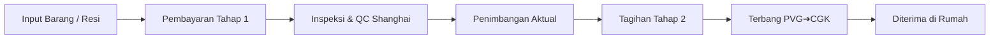

# ✈️ FLYPICK (fp-store-web)

> **China-to-Indonesia Cross-Border Jastip & Logistics Hub**  
> *Sistem Konsolidasi & Freight Forwarder Transparan: Taobao, 1688, Tmall ➔ Indonesia.*

[](https://nextjs.org/)
[](https://react.dev/)
[](https://tailwindcss.com/)
[](https://github.com/pmndrs/zustand)
[](https://biomejs.dev/)
[](https://www.typescriptlang.org/)

---

## 📋 Daftar Isi
1. [Tentang FLYPICK](#-tentang-flypick)
2. [Desain Sistem & Travel-Paper Aesthetic](#-desain-sistem--travel-paper-aesthetic)
3. [Fitur Utama & E2E Flows](#-fitur-utama--e2e-flows)
4. [Tech Stack & Tooling](#-tech-stack--tooling)
5. [Struktur Direktori](#-struktur-direktori)
6. [Instalasi & Menjalankan Proyek](#-instalasi--menjalankan-proyek)
7. [Alur Bisnis 2-Tahap (Stage 1 & Stage 2)](#-alur-bisnis-2-tahap-stage-1--stage-2)
8. [Script yang Tersedia](#-script-yang-tersedia)

---

## 🌟 Tentang FLYPICK

**FLYPICK** adalah platform web modern untuk layanan jasa titip (Jastip) dan freight forwarding lintas negara yang menjembatani pembelian barang dari marketplace Tiongkok (**Taobao, Tmall, dan 1688**) ke Indonesia tanpa kendala bahasa, rekening valuta asing (RMB/Alipay), maupun perizinan bea cukai.

Platform ini menerapkan model **dua layanan utama (Dual-Service)**:
- **Titip Dibeliin (Buy For Me):** Pengguna cukup menempelkan tautan produk Tiongkok. Tim gudang FLYPICK di Shanghai yang membelikan dan mengurus pembayaran seller.
- **Titip Kirim (Self-Checkout Forwarding):** Pengguna berbelanja mandiri di marketplace Tiongkok dengan alamat Gudang Shanghai milik FLYPICK, kemudian mendaftarkan nomor resi lokal China ke sistem konsolidasi.

---

## 🎨 Desain Sistem & Travel-Paper Aesthetic

FLYPICK dirancang dengan identitas visual bertema **Travel Paper / Flight Boarding Pass & Airport Cargo**:

- **Color Palette & Design Tokens:**
  - `Cream` (`#FFF8E1`): Latar belakang canvas kertas tiket vintage.
  - `Neon Blue` (`#2323FF`): Garis pembatas boarding pass, badge status kargo, dan heading bertegangan tinggi.
  - `Electric Blue` (`#00F0FF`): Aksen glow, tombol aksi interaktif, dan status pelacakan aktif.
  - `Dark Charcoal` (`#1A1A24`): Tipografi tajam berkontras tinggi dan aksen stempel stensil.
  - `Surface` (`#FFFFFF`): Badan kartu dan input formulir.
- **Visual Elements:**
  - Potongan lekuk tiket semi-lingkaran (*cutout notches*).
  - Garis sobek perforasi putus-putus (*dashed tear-off lines*).
  - Barcode realistis monospaced untuk tanda pengenal kargo (*airport barcodes*).
  - Rubber stamp stensil status penerbangan kargo (*"100% BEBAS REDLINE"*, *"PHOTO QC SHANGHAI"*).
  - Kartu label koper (*Luggage tag with eyelet punch ring*).

---

## 🚀 Fitur Utama & E2E Flows

### Screen 1: Login & Virtual Warehouse Pass
- **WhatsApp OTP Modal:** Simulasi autentikasi OTP WhatsApp via TanStack React Query (`useMutation`) dengan kode uji cepat (`888888`) serta dukungan Google OAuth.
- **Virtual Warehouse Luggage Card:**
  - Kartu tanda pengenal gudang Shanghai berdesain tag koper.
  - Menyediakan kode gudang unik pengguna (contoh: `FP-8821`).
  - Alamat lengkap Shanghai Pudong Free Trade Zone (Bahasa Mandarin & Inggris).
  - Fitur **1-Klik Salin Alamat Gudang** ke clipboard dengan notifikasi toast.

### Screen 2: Intake Hub & Keranjang Konsolidasi
- **Segmented Dual Tab:**
  - **Tab 1: Titip Dibeliin:** Input tautan Taobao/1688 dengan simulasi scraper metadata otomatis (`useScrapeProductMutation`), konversi kurs live CNY ➔ IDR (`¥1 = Rp 2.250`), varian warna/ukuran, dan kuantitas.
  - **Tab 2: Titip Kirim:** Input nomor resi domestik China (`SF...`, `YT...`), pemilihan kategori kargo (`FASHION`, `ELECTRONICS`, `BEAUTY`, dll.), dan deklarasi nilai barang.
- **Boarding Pass Cart Items:**
  - Item belanja berformat tiket boarding pass dengan pembatas berpori (*perforated divider*).
  - Badge pembeda jelas: `[TITIP DIBELIIN]` vs `[TITIP KIRIM]`.
  - Kontrol penyesuaian kuantitas & kalkulator subtotal dinamis.

### Screen 3: Order Checkout & Pembayaran Tahap 1
- **Step 1:** Formulir alamat pengiriman penerima Indonesia tervalidasi skema Zod.
- **Step 2:** Pemilihan jalur kargo internasional:
  - **Air Express Flight Cargo (7–10 Hari Kerja)** — Rp 165.000/kg.
  - **Sea Economy Container Liner (20–28 Hari Kerja)** — Rp 45.000/kg.
- **Step 3:** Layanan tambahan (*Add-ons*):
  - Photo QC & Inspeksi Fisik di Shanghai.
  - Ekstra Bubble Wrap 3 Lapis & Lakban Kuning.
- **Step 4:** Ringkasan Invoice Tahap 1 (Harga Barang + Handling Fee) disertai **Disclaimer pelunasan ongkir kargo internasional (Tahap 2)**.
- **Mock Payment Modal:** Simulasi gateway pembayaran via QRIS (semua e-wallet) atau BCA Virtual Account dengan efek perayaan konfeti dan penerbitan tiket pesanan.

### Screen 4: Profil & 7-Stage Live Tracking Stepper
- **Stepper 7 Tahap Operasional Logistik:**
  1. `[Order Placed]` — Pesanan dibuat & invoice tahap 1 terverifikasi.
  2. `[Purchased/Inbound]` — Pembelian ke merchant / resi domestik menuju Shanghai.
  3. `[Arrived at China Hub]` — Paket tiba di Pudong FTZ Hub (PVG-01).
  4. `[In Transit PVG➔CGK]` — Kargo terbang dalam pesawat Boeing 777F rute Shanghai ➔ Jakarta.
  5. `[Customs Clearance]` — Pemeriksaan dokumen impor & bea cukai Bandara CGK.
  6. `[Dispatched]` — Serah terima ke ekspedisi lokal rute kota tujuan.
  7. `[Delivered]` — Paket diterima di tangan pemesan.
- **Laporan Photo QC Unboxing:**
  - Ditampilkan saat paket tiba di Gudang China (`Arrived at China Hub` ke atas).
  - Menampilkan foto unboxing beresolusi tinggi, timbangan berat aktual (`1.15 kg`), dimensi paket (`32 x 24 x 12 cm`), stempel petugas QC (`Wang Lin, PVG-QC-07`), checklist fisik, dan catatan inspektur.
- **Log Manifest Aktivitas:** Riwayat linimasa logistik dengan waktu dan koordinat lokasi.

---

## 🛠️ Tech Stack & Tooling

| Teknologi | Peran |
|---|---|
| **Next.js 16 (App Router)** | Framework React utama dengan Turbopack |
| **React 19** | Library UI modern (Server & Client Components) |
| **Tailwind CSS v4** | Desain styling utility-first |
| **Class Variance Authority (CVA)** | Pembuatan varian komponen UI (Buttons, Badges, Cards) |
| **Zustand (`persist`)** | State management global untuk Cart, Auth, dan Checkout |
| **TanStack React Query v5** | Server state management, auto-scraper hook, dan mutasi OTP |
| **Zod & React Hook Form** | Skema validasi formulir type-safe |
| **Biome.js** | Linter & formatter berkecepatan tinggi |
| **Lucide React** | Ikon visual antarmuka |
| **Canvas Confetti** | Animasi selebrasi penyelesaian pembayaran |

---

## 📁 Struktur Direktori

```text
fp-store-web/
├── public/                 # Aset statis & logo placeholder
├── src/
│   ├── app/
│   │   ├── cart/page.tsx   # Screen 2: Keranjang konsolidasi
│   │   ├── checkout/       # Screen 3: Alamat, freight, & pembayaran tahap 1
│   │   ├── profile/        # Screen 1 & 4: Virtual warehouse pass & live tracking
│   │   ├── globals.css     # Theme tokens, ticket notches, & barcode CSS
│   │   ├── layout.tsx      # Root layout, font Geist, Query & Toast providers
│   │   └── page.tsx        # Screen 2: Landing page & Intake Hub
│   ├── components/
│   │   ├── branding/       # BrandLogo component ("FLYPICK +")
│   │   ├── cart/           # CartItemCard (Boarding pass style), CartSummary
│   │   ├── checkout/       # AddressStep, FreightStep, AddOnsStep, PaymentModal
│   │   ├── intake/         # IntakeTabs, BuyForMeForm, ForwardingForm
│   │   ├── layout/         # Navbar (live ticker), Footer
│   │   ├── profile/        # VirtualWarehouseCard, TrackingStepper, QcUnboxingCard, LoginModal
│   │   └── ui/             # Button (CVA), Badge, Barcode, TicketCard
│   ├── config/
│   │   └── branding.ts     # Konfigurasi kurs, alamat Shanghai, tarif kargo, & kontak
│   ├── hooks/
│   │   ├── use-auth-mutations.ts  # TanStack Query mutasi OTP WhatsApp
│   │   └── use-scrape-product.ts   # Simulasi ekstraksi metadata Taobao/1688
│   ├── lib/
│   │   ├── formatters.ts   # Pemformat mata uang (IDR, CNY) & generator ID
│   │   ├── query-client.ts # TanStack Query Client singleton
│   │   └── utils.ts        # Helper cn (clsx + twMerge)
│   ├── providers/
│   │   ├── query-provider.tsx     # Client provider TanStack React Query
│   │   └── toast-provider.tsx     # Notifikasi toast bergaya tiket koper
│   ├── schemas/            # Skema Zod (auth, buy-for-me, forwarding, checkout)
│   ├── store/              # Zustand stores (useAuthStore, useCartStore, useCheckoutStore)
│   └── types/              # Definisi interface TypeScript global
├── biome.json              # Konfigurasi Biome linter & formatter
├── next.config.ts          # Konfigurasi Next.js
├── package.json            # Daftar dependensi & npm scripts
└── tsconfig.json           # Konfigurasi TypeScript
```

---

## ⚡ Instalasi & Menjalankan Proyek

### 1. Klon Repositori
```bash
git clone https://github.com/Flypick-Nevermind/fp-store-web.git
cd fp-store-web
```

### 2. Pasang Dependensi
```bash
npm install
```

### 3. Jalankan Development Server
```bash
npm run dev
```

Buka peramban di: **`http://localhost:3000`** *(atau port yang dialokasikan oleh Next.js)*.

---

## 💡 Alur Bisnis 2-Tahap (Stage 1 & Stage 2)

FLYPICK menggunakan sistem penagihan transparan 2 tahap agar pelanggan hanya membayar biaya kargo yang sesuai dengan berat riil:



1. **Tagihan Tahap 1 (Awal):**
   - Nilai barang yang ditalangkan ke merchant Tiongkok (konversi CNY ➔ IDR).
   - Biaya jasa handling konsolidasi Shanghai (Rp 15.000 / paket).
   - Layanan proteksi tambahan opsional (Photo QC: Rp 10.000, Bubble Wrap: Rp 12.000).
2. **Tagihan Tahap 2 (Setelah Tiba di Shanghai):**
   - Dihitung transparan berdasarkan **berat aktual per kilogram** setelah seluruh paket tiba di Shanghai Hub dan di-packing ulang.
   - Air Express: Mulai Rp 165.000/kg (7–10 Hari).
   - Sea Economy: Mulai Rp 45.000/kg (20–28 Hari).

---

## 📜 Script yang Tersedia

- `npm run dev` : Menjalankan server pengembangan lokal (Next.js Turbopack).
- `npm run build` : Memeriksa tipe TypeScript dan membangun bundle produksi Next.js.
- `npm run start` : Menjalankan server aplikasi bundle produksi.
- `npm run lint` : Menjalankan pemeriksaan kode menggunakan Biome.js.
- `npm run format` : Memformat kode secara otomatis menggunakan Biome.js.

---

## 📄 Lisensi

Hak Cipta © 2026 **FLYPICK Cross-Border Logistics**. Seluruh hak cipta dilindungi undang-undang.
