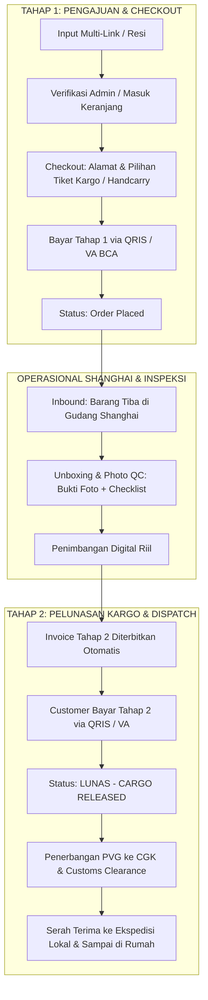

# ✈️ FLYPICK (fp-store-web)

> **China-to-Indonesia Cross-Border Jastip & Logistics Hub**  
> *Sistem Konsolidasi, Verifikasi Link, & Freight Forwarder Transparan: Taobao, 1688, Tmall, Pinduoduo ➔ Indonesia.*

[](https://nextjs.org/)
[](https://react.dev/)
[](https://tailwindcss.com/)
[](https://github.com/pmndrs/zustand)
[](https://biomejs.dev/)
[](https://www.typescriptlang.org/)

---

## 📋 Daftar Isi
1. [Tentang FLYPICK](#-tentang-flypick)
2. [Desain Sistem & Identitas Visual](#-desain-sistem--identitas-visual)
3. [Alur Bisnis & Model Pengiriman](#-alur-bisnis--model-pengiriman)
4. [Fitur Utama & E2E Customer Flow](#-fitur-utama--e2e-customer-flow)
   - [1. Beranda: Single-Screen Hero & Multi-Link Intake](#1-beranda-single-screen-hero--multi-link-intake-)
   - [2. Portal Admin Dashboard: Verifikasi & Notifikasi](#2-portal-admin-dashboard-verifikasi--notifikasi-admin)
   - [3. Sistem Autentikasi & Reset Password Lengkap](#3-sistem-autentikasi--reset-password-lengkap)
   - [4. Keranjang Konsolidasi & Sinkronisasi API](#4-keranjang-konsolidasi--sinkronisasi-api-cart)
   - [5. Checkout: Split-View & 2 Tiket Pengiriman](#5-checkout-split-view--2-tiket-pengiriman-checkout)
   - [6. Profil: 3 Tab Tracking, Manifest & Gudang](#6-profil-3-tab-tracking-manifest--gudang-profile)
5. [Tech Stack & Tooling](#-tech-stack--tooling)
6. [Struktur Direktori Proyek](#-struktur-direktori-proyek)
7. [Instalasi & Menjalankan Proyek](#-instalasi--menjalankan-proyek)
8. [Panduan Deploy ke Vercel](#-panduan-deploy-ke-vercel)
9. [Script & Konfigurasi Linter/Formatter](#-script--konfigurasi-linterformatter)

---

## 🌟 Tentang FLYPICK

**FLYPICK** adalah platform web modern untuk layanan jasa titip (Jastip) dan freight forwarding lintas negara yang menjembatani pembelian barang dari marketplace Tiongkok (**Taobao, Tmall, 1688, Pinduoduo, dan Alibaba**) ke Indonesia tanpa kendala bahasa, rekening valuta asing (RMB/Alipay), maupun perizinan bea cukai.

Platform ini menerapkan model **dua layanan utama (Dual-Service)**:
- **Titip Dibeliin (Buy For Me):** Pengguna cukup mengirimkan link produk Tiongkok. Tim FLYPICK di Shanghai memverifikasi ketersediaan stok, membelikan produk, dan mengurus pembayaran seller.
- **Titip Kirim (Self-Checkout Forwarding):** Pengguna berbelanja mandiri di marketplace Tiongkok menggunakan alamat Gudang Shanghai milik FLYPICK, kemudian mendaftarkan nomor resi lokal China ke sistem konsolidasi.

---

## 🎨 Desain Sistem & Identitas Visual

FLYPICK mengusung tema **Travel-Paper & Aviation Aesthetic** yang memadukan kehangatan tiket fisik dengan ketajaman antarmuka modern:

- **Single-Screen Hero (Tanpa Scroll Panjang):**
  - Tampilan beranda dirancang kompak, rapi, dan langsung menyajikan form pengajuan link di layar utama.
  - Logo gradasi `F` di tengah, headline *"FROM CHINA TO YOUR DOORSTEP"*, dan visual penerbangan (Boarding pass tiket di kiri, lintasan terbang melingkar, dan pesawat jet di kanan).
- **Color Palette & Visual Tokens:**
  - `Warm Ivory` (`#FAF8F5`): Canvas latar belakang lembut yang nyaman di mata.
  - `Royal Aviation Blue` (`#1035D0`): Warna primer maskapai, button hover, dan aksen tiket.
  - `Electric Cyan` (`#00F0FF` / `#00C2FF`): Aksen gradasi futuristik dan highlight status.
  - `Dark Slate / Charcoal` (`#0F172A`): Tipografi tajam berkontras tinggi.
- **Micro-Interactions & Komponen Tiket:**
  - Pembatas berpori (*perforated divider*), barcode dinamis, stempel karet (*rubber stamp* `LUNAS - CARGO RELEASED`), dan animasi perayaan konfeti saat pembayaran sukses.

---

## 💡 Alur Bisnis & Model Pengiriman

### Pilihan 2 Tiket Jasa Pengiriman (Shanghai ➔ Indonesia)

Pada tahap Checkout, pengguna dapat memilih antara 2 jenis tiket pengiriman resmi:

1. **Tiket Jasa Cargo (Air & Sea Cargo Hub):**
   - **Tarif:** Rp 165.000 / kg (Air Express) atau Rp 45.000 / kg (Sea Economy).
   - **Estimasi:** 7 - 10 Hari Kerja (Udara) / 20 - 28 Hari (Laut).
   - **Sistem Pembayaran 2-Tahap (Two-Stage Model):**
     - **Tahap 1:** Pembayaran talangan produk, handling fee Shanghai, dan proteksi tambahan saat checkout.
     - **Tahap 2:** Ongkir kargo riil ditagihkan setelah paket tiba dan ditimbang di Gudang Shanghai (PVG-01).
   - **Cocok Untuk:** Belanja partai banyak, ukuran besar, atau volume kargo berat.

2. **Tiket Jasa Handcarry (VIP Traveler Luggage):**
   - **Tarif:** Rp 95.000 / pcs (All-in).
   - **Estimasi:** 3 - 5 Hari Kerja (Super Cepat).
   - **Sistem Pembayaran 1 Tahap Langsung Lunas:** Dibawa langsung dalam bagasi kabin oleh traveler resmi FLYPICK tanpa antrean kontainer pelabuhan.
   - **Cocok Untuk:** Barang fashion, kosmetik, elektronik kecil, atau pesanan mendesak.



---

## 🚀 Fitur Utama & E2E Customer Flow

### 1. Beranda: Single-Screen Hero & Multi-Link Intake (`/`)
- **Direct Multi-Link Intake Form:**
  - Input banyak link produk China sekaligus dalam 1 pengajuan tanpa harus bolak-balik.
  - Tambah / hapus baris tautan dinamis (`+ Tambah Link Produk Lain`).
  - Kolom **Catatan Spesifikasi Khusus** per link (warna, ukuran, varian, dan kuantitas).
  - Tombol **"Coba Link Demo"** untuk pengujian instan dengan contoh link Taobao dan Tmall.
  - Dukungan pengajuan oleh pengguna terdaftar maupun sebagai **Guest** (cukup isi nama & nomor WhatsApp).
- **Submission Confirmation Modal:**
  - Menerbitkan ID Pengajuan unik instan (contoh: `SUB-202610-8912`).
  - Menampilkan ringkasan link yang diajukan beserta estimasi waktu review (15–30 menit).
  - Tombol pintas menuju pelacakan di halaman profil atau menghubungi tim via WhatsApp.

### 2. Portal Admin Dashboard: Verifikasi & Notifikasi (`/admin`)
- **Kartu Metrik Operasional:**
  - Menampilkan ringkasan data real-time: Total Pengajuan, Menunggu Review, Selesai Dicek, dan Notifikasi Terkirim.
- **Tabel Pengajuan Terintegrasi (`AdminSubmissionTable`):**
  - Filter cepat berdasarkan status (`ALL`, `PENDING_REVIEW`, `REVIEWED`, `NOTIFIED`).
  - Pencarian fleksibel berdasarkan ID pengajuan, nama pelanggan, atau nomor telepon.
- **Modal Review Detail (`AdminReviewDetailModal`):**
  - Periksa setiap tautan barang satu per satu dengan tombol langsung buka tautan sumber.
  - Ubah status per link: `AVAILABLE`, `UNAVAILABLE`, atau `NEEDS_CONFIRMATION`.
  - Input estimasi harga beli CNY dengan konversi otomatis ke IDR (`¥1 = Rp 2.250`).
  - Tambahkan catatan admin khusus per item dan catatan menyeluruh (*overall notes*).
  - Mengubah status tiket menjadi `REVIEWED` dan mencatat nama reviewer.
- **Modal Notifikasi Pelanggan (`AdminNotifyModal`):**
  - Susun template pesan notifikasi otomatis yang mencantumkan status barang dan estimasi biaya.
  - Pilihan kanal pengiriman: **WhatsApp** dan **Email**.
  - Menyimpan log riwayat notifikasi lengkap beserta timestamp pengiriman.

### 3. Sistem Autentikasi & Reset Password Lengkap
- **Komponen Modal Autentikasi Terpadu (`LoginModal`):**
  - **Login:** Autentikasi menggunakan Email & Password dengan validasi skema Zod.
  - **Registrasi Akun Baru:** Input nama lengkap, email, nomor HP/WhatsApp, dan password.
  - **Verifikasi OTP:** Input 6-digit OTP verifikasi aktivasi akun dengan tombol kirim ulang (*Resend OTP*).
  - **Lupa Password (`RESET_REQUEST`):** Permintaan kode OTP reset password yang dikirim ke email terdaftar.
  - **Konfirmasi Reset Password (`RESET_CONFIRM`):** Verifikasi OTP dan pembuatan password baru.
- **Integrasi API & Resilient Mock Fallback:**
  - Terhubung langsung ke endpoint REST API (`/api/v1/auth/*`).
  - Dilengkapi mekanisme fallback offline otomatis sehingga flow presentasi dan demo tetap berjalan mulus meskipun backend server belum online.
  - State login tersimpan persisten di LocalStorage via `useAuthStore`.

### 4. Keranjang Konsolidasi & Sinkronisasi API (`/cart`)
- **Sinkronisasi Otomatis:** Menghubungkan state lokal Zustand dengan data keranjang server (`useUserCartsQuery`).
- **Boarding Pass Item Cards:** Menampilkan rincian barang, gambar produk, harga CNY & IDR, serta pengatur kuantitas `[-] [qty] [+]`.
- **Kalkulasi Biaya Transparan:** Subtotal harga barang, estimasi berat, handling fee, dan tombol navigasi langsung ke checkout.

### 5. Checkout: Split-View & 2 Tiket Pengiriman (`/checkout`)
- **Split-View Modern:**
  - **Sisi Kiri:**
    - Pemilihan 2 Tiket Jasa Pengiriman (**Cargo Hub** vs **VIP Handcarry**).
    - Formulir alamat lengkap pengantaran Indonesia (Nama, HP, Alamat, Kota, Kode Pos).
    - Opsi Proteksi Tambahan: *Photo QC Shanghai Hub* (Rp 10.000) & *Extra Bubble Wrap 3 Lapis* (Rp 12.000).
  - **Sisi Kanan:**
    - **Result Biaya Card:** Kalkulasi live subtotal barang, handling fee, biaya tiket pengiriman, add-ons, dan grand total.
- **Interactive Payment Modal:**
  - Pilihan metode: **QRIS Real-Time** (semua e-wallet & m-banking) atau **Virtual Account BCA**.
  - Countdown timer pembayaran (15 menit).
  - Animasi perayaan konfeti saat simulasi pembayaran berhasil dan penerbitan tiket pesanan resmi.

### 6. Profil: 3 Tab Tracking, Manifest & Gudang (`/profile`)
- **Tab 1: Status Cek Link (`SUBMISSIONS`):**
  - Melihat daftar semua pengajuan link produk yang telah disubmit.
  - Indikator status review: `Menunggu Review`, `Selesai Dicek`, atau `Terkirim Notifikasi`.
  - Detail status ketersediaan per barang (`Tersedia`, `Habis`, `Perlu Konfirmasi`) beserta estimasi harga dan catatan admin.
- **Tab 2: Manifest Kargo & Handcarry (`MANIFEST`):**
  - Pelacakan 7 tahap logistik penerbangan:
    1. `[Order Placed]` ➔ 2. `[Purchased/Inbound]` ➔ 3. `[Arrived at China Hub]` ➔ 4. `[In Transit PVG➔CGK]` ➔ 5. `[Customs Clearance]` ➔ 6. `[Dispatched]` ➔ 7. `[Delivered]`.
  - Laporan unboxing & Photo QC Gudang Shanghai (bukti foto unboxing, timbangan riil, dimensi kotak, dan stempel petugas QC).
  - **Pembayaran Pelunasan Tahap 2:** Banner tagihan ongkir kargo riil dengan modal pembayaran QRIS/VA dan stempel karet `LUNAS - CARGO RELEASED`.
- **Tab 3: Gudang Shanghai (`WAREHOUSE`):**
  - Kartu identitas virtual warehouse pass dengan kode unik pengguna (contoh: `FP-8821`).
  - Alamat lengkap Shanghai Pudong Free Trade Zone dalam Bahasa Mandarin & Inggris.
  - Fitur **1-Klik Salin Alamat Gudang** ke clipboard dengan notifikasi toast.

---

## 🛠️ Tech Stack & Tooling

| Kategori | Teknologi | Kegunaan |
|---|---|---|
| **Framework** | Next.js 16 (App Router) | Server-side rendering, routing modular, dan Turbopack bundler |
| **UI Library** | React 19 | Komponen antarmuka modern (Server & Client Components) |
| **Styling** | Tailwind CSS v4 | Utility-first CSS styling dengan CSS custom tokens |
| **State Management** | Zustand (`persist`) | Store global untuk Keranjang, Autentikasi, Checkout, dan Submissions |
| **Data Fetching** | TanStack React Query v5 | Pengelolaan asynchronous state, API mutations, dan caching |
| **Form Validation** | Zod & React Hook Form | Validasi formulir type-safe untuk Auth, Intake, dan Alamat |
| **Linter & Formatter** | Biome.js 2.4 | Linter & formatter berkecepatan tinggi dengan auto-format on save |
| **Icons & Effects** | Lucide React & Canvas Confetti | Ikonografi modern dan efek animasi perayaan transaksi |

---

## 📁 Struktur Direktori Proyek

```text
fp-store-web/
├── public/                     # Aset publik, logo SVG, dan favicon
├── src/
│   ├── app/                    # Next.js App Router Pages
│   │   ├── page.tsx            # Beranda: LandingTemplate (Single-Screen Hero & Multi-Link)
│   │   ├── admin/page.tsx      # Portal Admin: AdminDashboardTemplate (Verifikasi & Notifikasi)
│   │   ├── cart/page.tsx       # Keranjang: CartTemplate (Konsolidasi & Sync)
│   │   ├── checkout/page.tsx   # Checkout: CheckoutTemplate (Split-View & 2 Tiket)
│   │   ├── profile/page.tsx    # Profil: ProfileTemplate (3 Tab Submissions, Manifest, Warehouse)
│   │   ├── globals.css         # Styling global, efek tiket notch, dan font Geist
│   │   └── layout.tsx          # Root Layout: Navbar, Footer, QueryProvider, ToastProvider
│   ├── components/
│   │   ├── admin/              # Komponen Admin: Table, Review Modal, Notify Modal
│   │   ├── atoms/              # Komponen Atom: Button, Badge, Barcode, Input, Stamp, Divider
│   │   ├── branding/           # Komponen Brand: FlypickLogoIcon, BrandLogo
│   │   ├── checkout/           # Komponen Checkout: ShippingTicketsSelector, ResultBiayaCard, PaymentModal
│   │   ├── home/               # Komponen Hero: HeroAviationVisual, HeroLinkInput
│   │   ├── intake/             # Komponen Intake: MultiLinkIntakeForm, SubmissionConfirmationModal
│   │   ├── layout/             # Komponen Navigasi: Navbar, Footer
│   │   ├── molecules/          # Komponen Molekul: CurrencyCalcBox, AddressCopyRow, QtyControl, EmptyState
│   │   ├── organisms/          # Komponen Organisme: CartItemCard, CartSummary, TrackingStepper, VirtualWarehouseCard
│   │   ├── profile/            # Komponen Profil: LoginModal, UserSubmissionsList, OrderTimeline, Stage2Payment
│   │   ├── templates/          # Template Halaman: Landing, Admin, Cart, Checkout, Profile
│   │   └── ui/                 # Reusable UI Primitives (Button, Badge, Barcode)
│   ├── config/                 # Konfigurasi branding, tarif kargo, dan alamat gudang
│   ├── hooks/                  # Custom React Hooks:
│   │   ├── use-auth-mutations.ts   # Mutasi Auth (Login, Register, OTP, Reset Password)
│   │   ├── use-cart-actions.ts     # Aksi keranjang & kalkulasi biaya
│   │   ├── use-cart-api.ts         # Query & mutation API keranjang
│   │   ├── use-checkout-flow.ts    # Alur multistep checkout & tiket pengiriman
│   │   ├── use-order-tracking.ts   # Pelacakan order & modal toggle
│   │   └── use-stage2-payment.ts   # Pelunasan ongkir kargo tahap 2
│   ├── lib/
│   │   ├── api/                    # Modul HTTP client API (auth.ts, cart.ts)
│   │   ├── api-client.ts           # Axios / fetch instance terpusat
│   │   └── utils.ts                # Helper formatters (formatIdr, formatCny, cn)
│   ├── providers/              # Context Providers (QueryProvider, ToastProvider)
│   ├── schemas/                # Strict Zod Schemas (auth.ts, checkout.ts, intake.ts)
│   ├── store/                  # Persistent Zustand Stores:
│   │   ├── use-auth-store.ts       # Status login, token JWT, dan data profil
│   │   ├── use-cart-store.ts       # Item keranjang dan kuantitas
│   │   ├── use-checkout-store.ts   # Pilihan tiket kargo, alamat, dan add-ons
│   │   └── use-submission-store.ts # Data pengajuan link, status review admin, & log notifikasi
│   └── types/                  # Definisi antarmuka TypeScript (api.ts, submission.ts, index.ts)
├── biome.json                  # Konfigurasi Biome linter, formatter, & import sorter
├── next.config.ts              # Konfigurasi Next.js (remote image patterns)
├── package.json                # Dependensi proyek & npm scripts
└── tsconfig.json               # Konfigurasi TypeScript paths (@/*)
```

---

## ⚡ Instalasi & Menjalankan Proyek

### 1. Klon Repositori
```bash
git clone https://github.com/Flypick-Nevermind/fp-store-web.git
cd fp-store-web
```

### 2. Pasang Dependensi
```bash
npm install
```

### 3. Jalankan Development Server
```bash
npm run dev
```

Buka peramban di: **`http://localhost:3000`** *(atau port yang dialokasikan oleh Next.js)*.

---

## 🚀 Panduan Deploy ke Vercel

### Metode 1: Lewat Web Dashboard Vercel (CI/CD Otomatis)
1. Buka [**vercel.com**](https://vercel.com/) dan masuk menggunakan akun GitHub Anda.
2. Klik tombol **"Add New..."** ➔ **"Project"**.
3. Cari repositori **`Flypick-Nevermind/fp-store-web`**, lalu klik **"Import"**.
4. Biarkan konfigurasi default (*Framework: Next.js*, *Root Directory: ./*, *Build Command: next build*).
5. Klik **"Deploy"**. Dalam ~1 menit, aplikasi siap diakses di URL produksi!
6. Setiap commit yang di-*push* ke branch `main` akan di-deploy secara otomatis.

### Metode 2: Lewat Vercel CLI (Terminal)
```bash
# Login & Deploy Preview
npx vercel

# Deploy Langsung ke Production
npx vercel --prod
```

---

## 📜 Script & Konfigurasi Linter/Formatter

### NPM Scripts
- `npm run dev` : Menjalankan server pengembangan lokal (Next.js dengan Turbopack).
- `npm run build` : Memeriksa tipe TypeScript dan membangun bundle produksi Next.js.
- `npm run start` : Menjalankan server aplikasi bundle produksi.
- `npm run lint` : Menjalankan pemeriksaan linter menggunakan Biome.js.
- `npm run format` : Memformat seluruh kode secara otomatis menggunakan Biome.js.

### Auto-Format on Save (Biome)
Proyek telah dilengkapi pengaturan workspace di `.vscode/settings.json` yang secara otomatis memformat kode dan merapikan import setiap kali file disimpan (`Cmd + S` / `Ctrl + S`):
- `editor.formatOnSave`: `true`
- `editor.defaultFormatter`: `"biomejs.biome"`
- `editor.codeActionsOnSave`: `"quickfix.biome"` & `"source.organizeImports.biome"`

---

## 📄 Lisensi

Hak Cipta © 2026 **FLYPICK Cross-Border Logistics**. Seluruh hak cipta dilindungi undang-undang.
