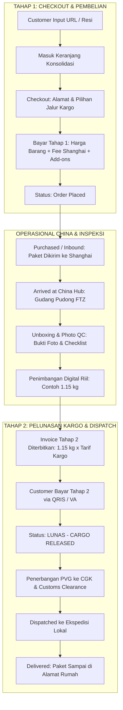

# ✈️ FLYPICK (fp-store-web)

> **China-to-Indonesia Cross-Border Jastip & Logistics Hub**  
> *Sistem Konsolidasi & Freight Forwarder Transparan: Taobao, 1688, Tmall ➔ Indonesia.*

[](https://nextjs.org/)
[](https://react.dev/)
[](https://tailwindcss.com/)
[](https://github.com/pmndrs/zustand)
[](https://biomejs.dev/)
[](https://www.typescriptlang.org/)

---

## 📋 Daftar Isi
1. [Tentang FLYPICK](#-tentang-flypick)
2. [Desain Sistem & Travel-Paper Aesthetic](#-desain-sistem--travel-paper-aesthetic)
3. [Alur Bisnis & Pembayaran 2-Tahap (Two-Stage Model)](#-alur-bisnis--pembayaran-2-tahap-two-stage-model)
4. [Fitur Utama & E2E Customer Flow](#-fitur-utama--e2e-customer-flow)
5. [Tech Stack & Tooling](#-tech-stack--tooling)
6. [Struktur Direktori (Atomic Design)](#-struktur-direktori-atomic-design)
7. [Instalasi & Menjalankan Proyek](#-instalasi--menjalankan-proyek)
8. [Panduan Deploy ke Vercel](#-panduan-deploy-ke-vercel)
9. [Script yang Tersedia](#-script-yang-tersedia)

---

## 🌟 Tentang FLYPICK

**FLYPICK** adalah platform web modern untuk layanan jasa titip (Jastip) dan freight forwarding lintas negara yang menjembatani pembelian barang dari marketplace Tiongkok (**Taobao, Tmall, dan 1688**) ke Indonesia tanpa kendala bahasa, rekening valuta asing (RMB/Alipay), maupun perizinan bea cukai.

Platform ini menerapkan model **dua layanan utama (Dual-Service)**:
- **Titip Dibeliin (Buy For Me):** Pengguna cukup menempelkan tautan produk Tiongkok. Tim buyer FLYPICK di Shanghai yang membelikan dan mengurus pembayaran seller.
- **Titip Kirim (Self-Checkout Forwarding):** Pengguna berbelanja mandiri di marketplace Tiongkok dengan alamat Gudang Shanghai milik FLYPICK, kemudian mendaftarkan nomor resi lokal China ke sistem konsolidasi.

---

## 🎨 Desain Sistem & Travel-Paper Aesthetic

FLYPICK dirancang dengan identitas visual bertema **Travel Paper / Flight Boarding Pass & Airport Cargo**:

- **Color Palette & Design Tokens:**
  - `Cream` (`#FFF8E1`): Latar belakang canvas kertas tiket vintage.
  - `Neon Blue` (`#2323FF`): Garis pembatas boarding pass, badge status kargo, dan heading utama.
  - `Electric Blue` (`#00F0FF`): Aksen glow, tombol aksi interaktif, dan status pelacakan aktif.
  - `Dark Charcoal` (`#1A1A24`): Tipografi tajam berkontras tinggi dan aksen stempel stensil.
  - `Surface` (`#FFFFFF`): Badan kartu dan input formulir.
- **Visual Elements:**
  - Potongan lekuk tiket semi-lingkaran (*cutout notches*).
  - Garis sobek perforasi putus-putus (*dashed tear-off lines*).
  - Barcode realistis monospaced untuk tanda pengenal kargo (*airport barcodes*).
  - Rubber stamp stensil status kargo (*"100% BEBAS REDLINE"*, *"PHOTO QC SHANGHAI"*, *"LUNAS - CARGO RELEASED"*).
  - Kartu label koper (*Luggage tag with eyelet punch ring*).

---

## 💡 Alur Bisnis & Pembayaran 2-Tahap (Two-Stage Model)

FLYPICK menerapkan model penagihan 2 tahap yang adil dan transparan: ongkir kargo internasional **tidak ditebak di awal**, melainkan dihitung berdasarkan **timbangan digital fisik riil** di gudang Shanghai FTZ setelah barang lolos inspeksi QC.

### Diagram Alur Operasional E2E



### Rincian Perbandingan Tagihan

| Komponen | Pembayaran Tahap 1 (Checkout) | Pembayaran Tahap 2 (Setelah QC Shanghai) |
| :--- | :--- | :--- |
| **Waktu Penagihan** | Saat membuat pesanan di web | Saat barang tiba & ditimbang di Gudang Shanghai (PVG-01) |
| **Item Tagihan** | • Nilai Barang (CNY ➔ IDR)<br>• Shanghai Handling Fee (Rp 15.000/item)<br>• Add-ons (Photo QC Rp 10.000, Extra Bubble Wrap Rp 12.000) | • Ongkir Kargo: `Berat Riil (kg) × Tarif/kg`<br>• Pajak Impor & Bea Masuk (All-in)<br>• Pengiriman Ekspedisi Lokal ke Rumah |
| **Tarif Kargo** | *Belum ditagihkan (hanya estimasi)* | • **Air Express:** Rp 165.000 / kg (7–10 Hari)<br>• **Sea Economy:** Rp 45.000 / kg (20–28 Hari) |
| **Metode Bayar** | QRIS (Semua E-Wallet) / Virtual Account | QRIS (Semua E-Wallet) / Virtual Account |
| **Efek Pelunasan** | Tiket pesanan diterbitkan & masuk antrean pembelian | Dokumen SPPB kargo rilis & diserahkan ke kurir domestik |

---

## 🚀 Fitur Utama & E2E Customer Flow

### Screen 1: Login & Virtual Warehouse Pass (`/`)
- **WhatsApp OTP Modal:** Simulasi autentikasi OTP WhatsApp via TanStack React Query (`useMutation`) dengan kode uji cepat (`888888`) serta dukungan Google OAuth.
- **Virtual Warehouse Luggage Card:**
  - Kartu tanda pengenal gudang Shanghai berdesain tag koper.
  - Kode gudang unik pengguna (contoh: `FP-8821`).
  - Alamat lengkap Shanghai Pudong Free Trade Zone (Bahasa Mandarin & Inggris).
  - Fitur **1-Klik Salin Alamat Gudang** ke clipboard dengan notifikasi toast.

### Screen 2: Intake Hub & Keranjang Konsolidasi (`/` & `/cart`)
- **Segmented Dual Tab:**
  - **Tab 1: Titip Dibeliin:** Input tautan Taobao/1688 dengan simulasi scraper metadata otomatis (`useScrapeProductMutation`), konversi kurs live CNY ➔ IDR (`¥1 = Rp 2.250`), varian warna/ukuran, dan kuantitas.
  - **Tab 2: Titip Kirim:** Input nomor resi domestik China (`SF...`, `YT...`), pemilihan kategori kargo (`FASHION`, `ELECTRONICS`, `BEAUTY`, dll.), dan deklarasi nilai barang.
- **Boarding Pass Cart Items:**
  - Item belanja berformat tiket boarding pass dengan pembatas berpori (*perforated divider*).
  - Badge pembeda jelas: `[TITIP DIBELIIN]` vs `[TITIP KIRIM]`.
  - Kontrol penyesuaian kuantitas & kalkulator subtotal dinamis.

### Screen 3: Order Checkout & Pembayaran Tahap 1 (`/checkout`)
- **Step 1:** Formulir alamat pengiriman penerima Indonesia tervalidasi skema Zod.
- **Step 2:** Pemilihan jalur kargo internasional (Air Express vs Sea Economy).
- **Step 3:** Layanan tambahan (*Add-ons*): Photo QC Shanghai & Ekstra Bubble Wrap 3 Lapis.
- **Step 4:** Ringkasan Invoice Tahap 1 (Harga Barang + Handling Fee) disertai disclaimer pelunasan kargo Tahap 2.
- **Payment Modal Tahap 1:** Simulasi gateway QRIS / Virtual Account dengan efek perayaan konfeti dan penerbitan tiket pesanan.

### Screen 4: Profil, 7-Stage Live Tracking & Pelunasan Tahap 2 (`/profile`)
- **Stepper 7 Tahap Operasional Logistik:**
  1. `[Order Placed]` — Pesanan dibuat & invoice tahap 1 terverifikasi.
  2. `[Purchased/Inbound]` — Pembelian ke merchant / resi domestik menuju Shanghai.
  3. `[Arrived at China Hub]` — Paket tiba di Pudong FTZ Hub (PVG-01).
  4. `[In Transit PVG➔CGK]` — Kargo terbang dalam pesawat Boeing 777F rute Shanghai ➔ Jakarta.
  5. `[Customs Clearance]` — Pemeriksaan dokumen impor & bea cukai Bandara CGK.
  6. `[Dispatched]` — Serah terima ke ekspedisi lokal rute kota tujuan.
  7. `[Delivered]` — Paket diterima di tangan pemesan.
- **Laporan Photo QC Unboxing:**
  - Bukti foto unboxing resolusi tinggi, timbangan berat aktual (`1.15 kg`), dimensi paket (`32 x 24 x 12 cm`), stempel petugas QC (`Wang Lin, PVG-QC-07`), checklist fisik, dan catatan inspektur.
- **Terminal Pembayaran Pelunasan Tahap 2:**
  - Banner tagihan pelunasan kargo otomatis (`1.15 kg × Rp 165.000 = Rp 189.750`).
  - Tombol **"Bayar Pelunasan Tahap 2"** membuka modal interaktif QRIS/VA.
  - Simulasi pembayaran sukses memicu animasi konfeti, stempel karet **`LUNAS - CARGO RELEASED`**, serta membuka rilis SPPB bea cukai ke ekspedisi lokal.

---

## 🛠️ Tech Stack & Tooling

| Teknologi | Peran |
|---|---|
| **Next.js 16 (App Router)** | Framework React utama dengan Turbopack |
| **React 19** | Library UI modern (Server & Client Components) |
| **Tailwind CSS v4** | Desain styling utility-first |
| **Class Variance Authority (CVA)** | Pembuatan varian komponen UI (Buttons, Badges, Cards) |
| **Zustand (`persist`)** | State management global untuk Cart, Auth, dan Checkout |
| **TanStack React Query v5** | Server state management, auto-scraper hook, dan mutasi OTP |
| **Zod & React Hook Form** | Skema validasi formulir type-safe |
| **Biome.js** | Linter & formatter berkecepatan tinggi |
| **Lucide React** | Ikon visual antarmuka |
| **Canvas Confetti** | Animasi selebrasi penyelesaian pembayaran |

---

## 📁 Struktur Direktori (Atomic Design)

```text
fp-store-web/
├── public/                 # Aset statis & logo placeholder
├── src/
│   ├── app/                # Clean Route Handlers (~5 baris per file, delegasi ke template)
│   │   ├── page.tsx        # / -> LandingTemplate
│   │   ├── cart/page.tsx   # /cart -> CartTemplate
│   │   ├── checkout/page.tsx # /checkout -> CheckoutTemplate
│   │   ├── profile/page.tsx  # /profile -> ProfileTemplate
│   │   ├── globals.css     # Theme tokens, ticket notches, & barcode CSS
│   │   └── layout.tsx      # Root layout, font Geist, Query & Toast providers
│   ├── components/
│   │   ├── atoms/          # Atomic: Button, Badge, Barcode, BrandLogo, Input, RubberStamp, TicketDivider
│   │   ├── molecules/      # Atomic: CurrencyCalcBox, AddressCopyRow, QtyControl, EmptyState
│   │   ├── organisms/      # Atomic: HeroFlightBanner, IntakeTabs, CartItemCard, CartSummary,
│   │   │                   #         AddressStep, FreightStep, AddOnsStep, InvoiceSummary, PaymentModal,
│   │   │                   #         VirtualWarehouseCard, TrackingStepper, QcUnboxingCard, 
│   │   │                   #         Stage2PaymentCard, Stage2PaymentModal, OrderTimeline, Navbar, Footer
│   │   └── templates/      # Atomic: LandingTemplate, CartTemplate, CheckoutTemplate, ProfileTemplate
│   ├── hooks/              # Decoupled Business Logic Hooks:
│   │   ├── use-buy-for-me-form.ts   # Scraper logic, Taobao link handling, & validation
│   │   ├── use-forwarding-form.ts   # China tracking manifests, courier presets, & declared value
│   │   ├── use-cart-actions.ts      # Cart store selectors, quantity operations, & subtotal IDR/CNY
│   │   ├── use-checkout-flow.ts     # Multi-step state, add-ons toggles, fees, & payment triggers
│   │   ├── use-stage2-payment.ts    # Stage 2 freight balance modal, calculations, & payment actions
│   │   ├── use-warehouse-pass.ts    # Shanghai warehouse address clipboard & toast copy actions
│   │   ├── use-order-tracking.ts    # Order history, timeline expansion, & login modal toggles
│   │   ├── use-scrape-product.ts    # Simulated marketplace metadata scraping
│   │   └── use-auth-mutations.ts    # WhatsApp OTP request & verify mutations
│   ├── config/             # Branding tokens, alamat gudang Shanghai, & tarif kargo
│   ├── lib/                # Utility helpers (cn, formatters, query client)
│   ├── providers/          # QueryProvider & ToastProvider
│   ├── schemas/            # Strict Zod schemas (auth, buy-for-me, forwarding, checkout)
│   ├── store/              # Zustand persistent stores (useAuthStore, useCartStore, useCheckoutStore)
│   └── types/              # Inferred domain TypeScript interfaces
├── biome.json              # Konfigurasi Biome linter & formatter
├── next.config.ts          # Konfigurasi Next.js (remote patterns foto unboxing & QRIS)
├── package.json            # Dependensi & npm scripts
└── tsconfig.json           # Konfigurasi TypeScript
```

---

## ⚡ Instalasi & Menjalankan Proyek

### 1. Klon Repositori
```bash
git clone https://github.com/Flypick-Nevermind/fp-store-web.git
cd fp-store-web
```

### 2. Pasang Dependensi
```bash
npm install
```

### 3. Jalankan Development Server
```bash
npm run dev
```

Buka peramban di: **`http://localhost:3000`** *(atau port yang dialokasikan oleh Next.js)*.

---

## 🚀 Panduan Deploy ke Vercel

### Metode 1: Lewat Web Dashboard Vercel (Rekomendasi CI/CD Otomatis)
1. Buka [**vercel.com**](https://vercel.com/) dan masuk menggunakan akun GitHub Anda.
2. Klik tombol **"Add New..."** ➔ **"Project"**.
3. Cari repositori **`Flypick-Nevermind/fp-store-web`**, lalu klik **"Import"**.
4. Biarkan konfigurasi default (*Framework: Next.js*, *Root Directory: ./*, *Build Command: next build*).
5. Klik **"Deploy"**. Dalam ~1 menit, aplikasi siap diakses di URL produksi!
6. Setiap commit yang di-*push* ke branch `main` akan di-deploy secara otomatis.

### Metode 2: Lewat Vercel CLI (Terminal)
```bash
# Login & Deploy Preview
npx vercel

# Deploy Langsung ke Production
npx vercel --prod
```

---

## 📜 Script yang Tersedia

- `npm run dev` : Menjalankan server pengembangan lokal (Next.js Turbopack).
- `npm run build` : Memeriksa tipe TypeScript dan membangun bundle produksi Next.js.
- `npm run start` : Menjalankan server aplikasi bundle produksi.
- `npm run lint` : Menjalankan pemeriksaan kode menggunakan Biome.js.
- `npm run format` : Memformat kode secara otomatis menggunakan Biome.js.

---

## 📄 Lisensi

Hak Cipta © 2026 **FLYPICK Cross-Border Logistics**. Seluruh hak cipta dilindungi undang-undang.
